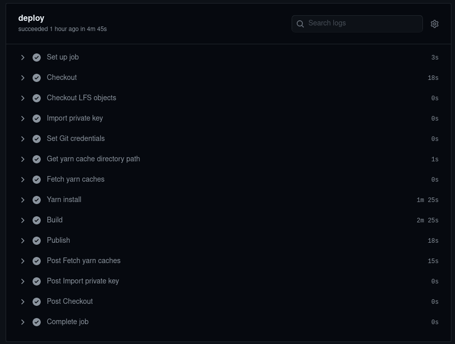

My website currently only has a frontend. Now, that's cool and all, but I want my website to be fancier than that, and have more user interactability that I can customize.

Okay, yes, there's no one visiting my site to begin with, but that won't stop me from wasting my time on this!

Some tasks, like commenting and analytics, are currently delegated to others. However, those services often track users and harvest their data, which isn't good or fun. And plus, it would be fun and resume-building to code those features in myself. Therefore, I'm adding in a backend.

## Planned Features

I want to add the following features when I release it:

- A login system that supports signing in with other providers, like Google or Github
- Self-hosted commenting
- A thing that tracks how many hits my pages get, so that I can display that on the page

Later on, I want to add more server-enhanced features:

- Blogging that's faster than running a full rebuild of the site
- Webmentions? IndieAuth?
- Fun analytics stuff.
- A full social media feed aggregator that tracks everything I post (not that I even post that much, though...)
- Maybe even a forum system! (Or I could just roll a Mastodon instance and call it a day. Or both...)

I'm also thinking of adding some other stuff to the server besides just a website backend. For example, a Minecraft server, or a Mastodon server.

## The technical crap

### Deployment and repo organization

The backend is currently on the `backend` branch of my git repo, located in the `astrid_tech_api` subfolder. It is written in Django, because I want to learn Django. Eventually, I'll fold the Gatsby frontend into a `astrid_tech_frontend` subfolder and run a monorepo.

I also want to deploy my website and the other goodies as a Docker container with Kubernetes, because I want to learn Docker and Kubernetes. If you're noticing a pattern here, I'm trying to learn stuff. Anyway, that's gonna get tossed into a `astrid_tech_deployment` subfolder.

```dot
digraph "The server infrastructure end up looking something like this." {
    label = "How the infrastructure might end up looking in the end"
    labelloc = b
    rankdir = TB
    newrank = true

    subgraph cluster_github {
        label = "Github"
        labeljust = l
        rank = 2
        ghpages[label = "plenglin.github.io" shape=component]
    }

    {
        rank = same
        django
        ghpages
    }

    subgraph cluster_backend {
        node [shape=component]
        edge [lblstyle="sloped" splines=false labeldistance=0]
        label = "VPS (All of these services are dockerized)"
        labeljust = l

        nginx [label="Nginx"]
        etc [label="..."]
        django [label="Django"]
        db [label="Postgres" shape=cylinder]
        mastodon [label="Mastodon"]
        matrix [label="Matrix"]
        minecraft [label="Minecraft"]

        nginx -> mastodon [label="mastodon.a.t"]
        nginx -> minecraft [label="dynmap.mc.a.t"]
        nginx -> matrix [label="matrix.a.t"]
        nginx -> django [label="api.a.t"]
        nginx -> etc [label="*.a.t"]
    }

    django -> db

    ghpages -> django [style=dashed label="API"]

    user1 [label="User 1\n(Job recruiter)"]
    user2 [label="User 2\n(Technology Enjoyer)"]

    user1 -> ghpages
    user2 -> ghpages

    user3 [label="User 3\n(Minecrafter)"]
    user3 -> minecraft
    user3 -> nginx

    {
        rank = min
        user1
        user2
        user3
    }
}
```

I'll likely keep the frontend on Github Pages so I can leech off of Microsoft's hosting. I'm looking at [Contabo](https://contabo.com/) for backend hosting, because their rates seem way better than anyone else I've seen. €4/mo (\$4.89/mo) gives you 2 cores, 4GB RAM, and 300GB hybrid drive storage! It's just in Germany, which is on the other side of the world and has 137ms latency. They also offer a US-based service that's €6/mo (\$7.34/mo) for an SSD with slightly lower storage, which might be more worth it.

Even though I'm running containers, I'm avoiding container hosting because I'm really cheap and I don't really care much for scalability. Plus, I want the experience of managing a server myself.

### Replacing Gatsby?

With this new backend coming in, I'm also considering moving to a new frontend framework. Essentially, Gatsby has a lot of issues with it. One of them is the long build times, which is worsened by how unreliable the cache is with my several custom plugins. Most of the runtime seems to be in generating images, but it might not be doing it very optimally; when it generates images, my CPU isn't being 100% used.




I wrote a script to limit the size of every image in my repository to 1600x1600, but that only reduced build time by 30 seconds.

```sh
maxsize () {
  convert $1 -resize 1600x1600\> $1
}

for file in $(find content assets -type f \( -iname "*.jpg" -o -iname "*.png" -o -iname "*.jpeg" \) )
do
  echo $file
  maxsize $file
done
```

The other issue is that it's [run by a sketchy company](https://twitter.com/tesseralis/status/1293649007739191296) that's kinda racist and transphobic, so I feel like I'd want to transition my own website off of that.

Using Next.js and building my own thumbnail generation/data pull system seems like the most logical alternative because:

1. It uses React, so I don't have to throw away all my components.
2. It's also statically generated so I can keep my site fast. Plus, there's an option for server-side rendering, allowing potentially faster updates if I choose to use it in the future.
3. It doesn't prescribe for you a data sourcing system to use, meaning I can write a custom data pulling/processing system that's more optimized for my site.
4. I don't really see anything _too_ massively controversial about Next.js from a quick Google search.

## Conclusion

I'm fairly hopeful for this server setup. It's gonna be an interesting experience to add this in, because I'm essentially taking an established product and adding functionality to it while maintaining it. And I'm not just doing it for a paycheck, I'm doing it for myself!
