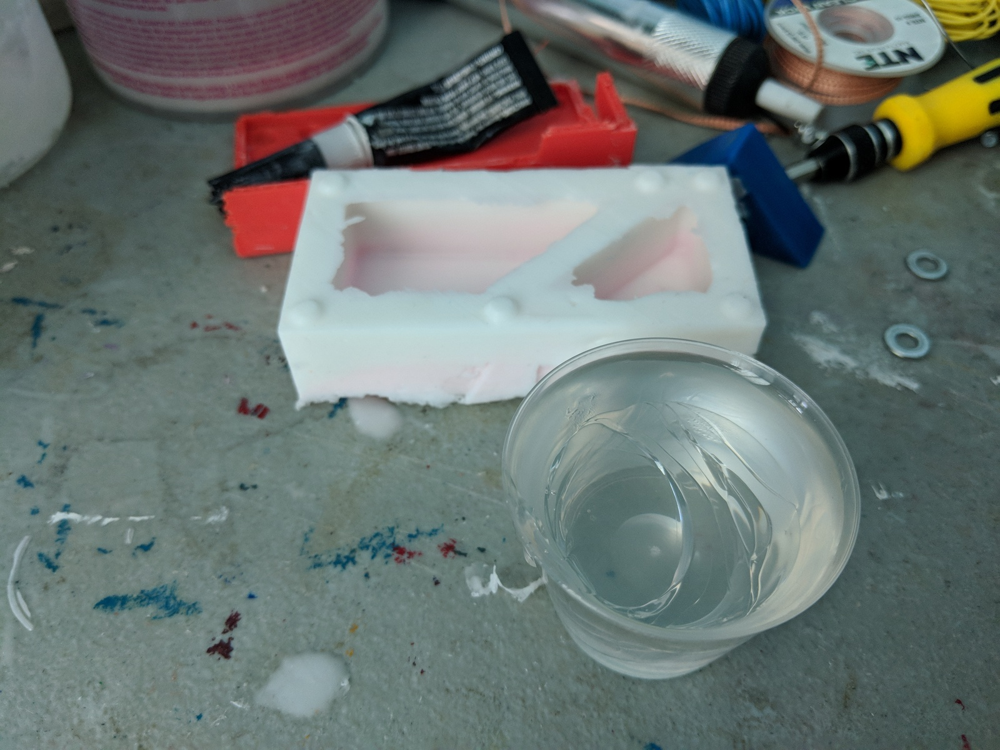

Low-cost experimental AR headset similar to the Google Glass.

At its heart was a Raspberry Pi Zero that drew images on an OLED display. The display projected images on the casted epoxy prism, which reflected images onto the user's eye. Its frame would have been made from 3D printed parts.

Unfortunately, the project was unsuccessful due to limitations in the epoxy casting process: the surface of the prism was too rough and opaque for any meaningful reflections.

If I were to remake the project, I would not have attempted to make it in the same way that Google did; I would use a method of reflecting OLED images into the user's eye other than the prism-based method they used.
