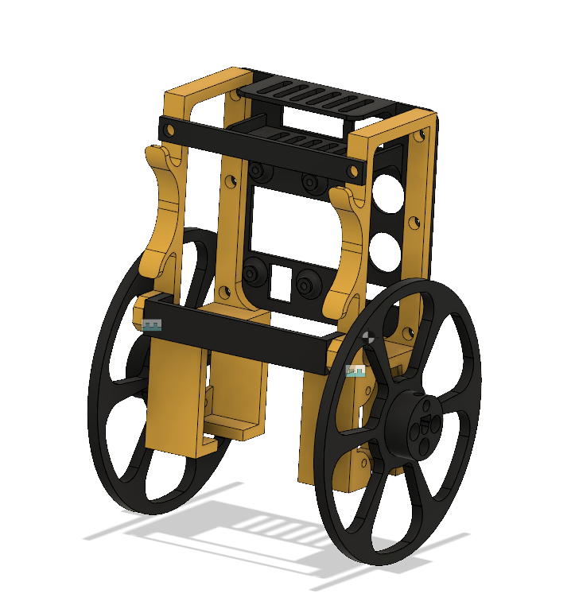

<iframe src="https://myhub.autodesk360.com/ue28d9dcb/shares/public/SH56a43QTfd62c1cd9686d80bb35b151eaf5?mode=embed" width="640" height="480" allowfullscreen="true" webkitallowfullscreen="true" mozallowfullscreen="true" title="The robot, in 3D" frameborder="0"></iframe>

Or, a 2D view of it for unsupported browsers:

- Designed, programmed, manufactured, and assembled a robot that can balance itself for 30 seconds on a carpet floor.
- Fused data from accelerometer and gyroscope to determine robot tilt.
- Researched methods to filter data more accurately, including moving average and exponential smoothing, complementary filters and Kalman filters.
